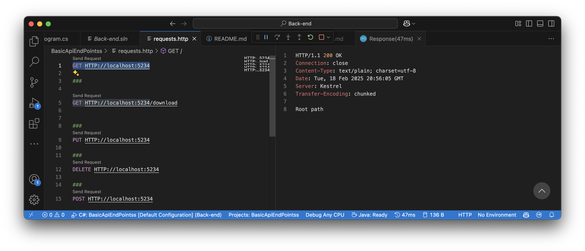
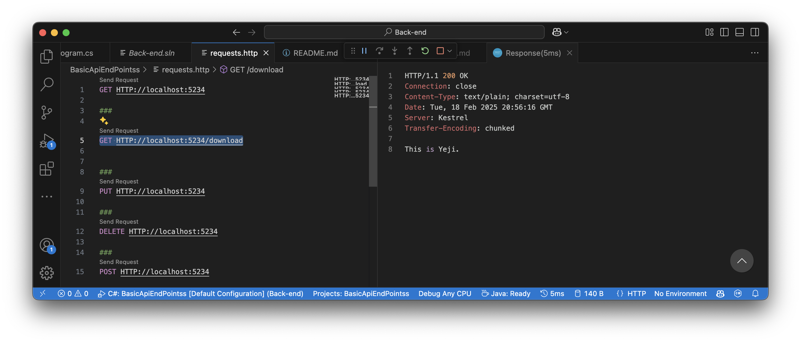
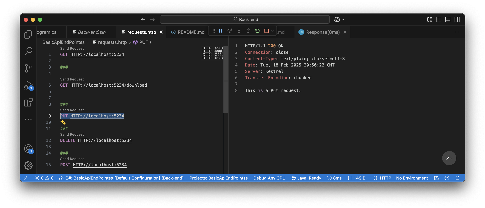
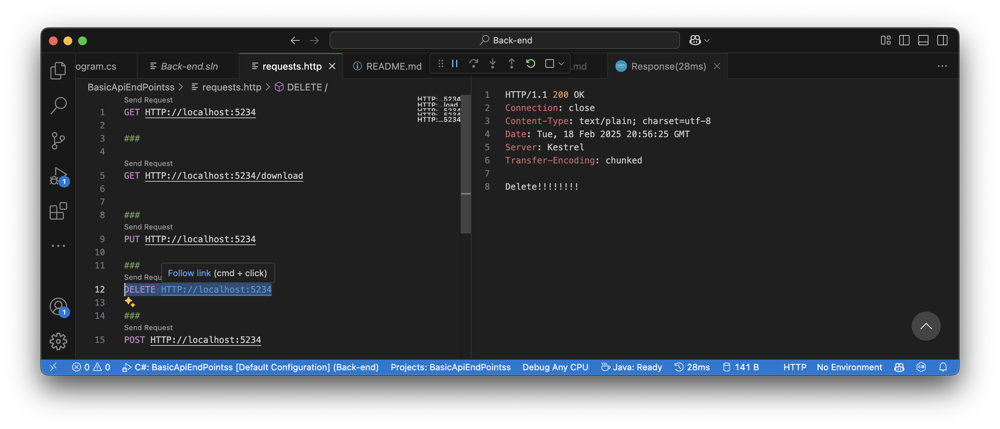
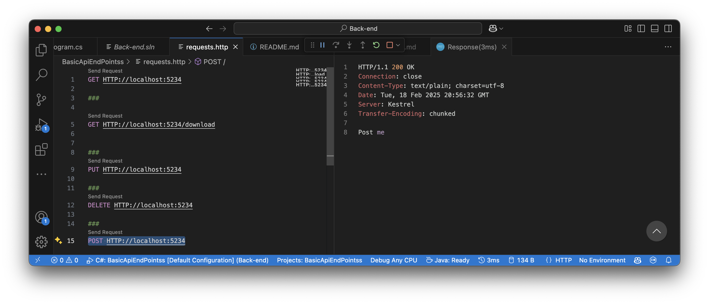

# 🚀 REST Client Extension for API Testing in Visual Studio Code

The **REST Client Extension** in Visual Studio Code (VS Code) allows you to test and interact with your APIs directly inside the editor. No need for external tools like Postman! 😎

## 🛠️ How to Install REST Client Extension in VS Code

1. **Open Visual Studio Code** 💻
2. Go to the **Extensions View** by clicking the Extensions icon in the sidebar or pressing `Cmd+Shift+X`.
3. In the search bar, type **"REST Client"** and press Enter 🔍.
4. Click **Install** on the extension by **Huachao Mao**.

After installation, you can start sending HTTP requests directly from `.http` files. 🎉

---

## 📑 Example Program.cs Code

In your **Program.cs** file, you can define various routes and HTTP methods for your API like so:

```csharp
var builder = WebApplication.CreateBuilder(args);
var app = builder.Build();

// Root path
app.MapGet("/", () => "Root path");

// Custom download route
app.MapGet("/download", () => "This is Yeji.");

// PUT request example
app.MapPut("/", () => "This is a Put request.");

// DELETE request example
app.MapDelete("/", () => "Delete!!!!!!!!");

// POST request example
app.MapPost("/", () => "Post me");

app.Run();
```

Explanation:
- GET: Retrieves data from the server.
- PUT: Updates an existing resource on the server.
- DELETE: Deletes a resource from the server.
- POST: Sends data to the server to create or update a resource.

Note: 
- After modifying the Program.cs file, restart the application for the changes to take effect.

## 🧪 Example requests.http File

Now, you can create a .http file to send different HTTP requests to your API. Here’s an example:

1️⃣ GET Request to Root Path
```csharp
GET http://localhost:5234
```


2️⃣ GET Request to Download Route
```csharp
GET http://localhost:5234/download
```


3️⃣ PUT Request to Root Path
```csharp
PUT http://localhost:5234
```


4️⃣ DELETE Request to Root Path
```csharp
DELETE http://localhost:5234
```


5️⃣ POST Request to Root Path
```csharp
POST http://localhost:5234
```


Note: After writing the request, simply click on the **Send Request** button to execute it and see the response.

## 🧑‍💻 How to Test Your API with the REST Client Extension
1.	Create a .http file in your VS Code project.
2.	Write your HTTP requests in the file.
3.	Click the Send Request link that appears above the request to send it. 🚀
4.	The response will appear below the request, showing the status code and body (e.g., the text returned by your API).

## 🔥 Why Use REST Client?
- No Need for External Tools: Test APIs directly from VS Code without leaving the editor. 👌
- Easy Debugging: Quickly send requests and view responses. 🔍
- No Configuration: Write and send requests in seconds! ⏱️

## 🎯 Conclusion

The REST Client Extension for Visual Studio Code makes API testing super simple and efficient. By using it, you can test GET, POST, PUT, and DELETE requests directly in your code editor. Save time and streamline your development process! 🚀✨